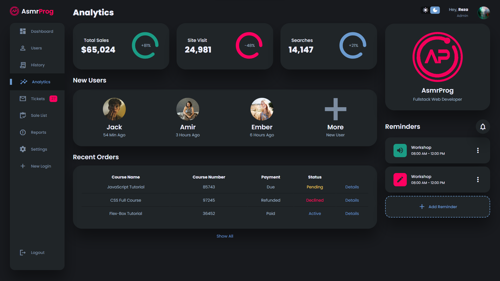

# Sobre
Design de página de dashboard completo. Este é um projeto desenvolvido utilizando HTML, CSS e Javascript.
Você pode acessá-lo com este [link](https://bellussi1.github.io/dashboard-theme/).





## Visão Geral
Esta landing page foi criada com o objetivo de fornecer uma experiência envolvente aos visitantes, utilizando animações sutis e interações intuitivas para destacar os principais pontos do seu produto, serviço ou marca.

## Como Utilizar
1. Clone este repositório em sua máquina local:
```
bash
Copy code
git clone https://github.com/Bellussi1/dashboard-theme.git
```
2. Abra o arquivo index.html em seu navegador web preferido.
3. Explore a página e adapte-a conforme suas necessidades. Sinta-se à vontade para personalizar o conteúdo, as cores e as animações de acordo com a identidade visual do seu projeto.

## Licença
Este projeto está licenciado sob a Licença MIT.

## Contato
Para mais informações ou dúvidas, entre em contato com enzobellussifam@gmail.com 
